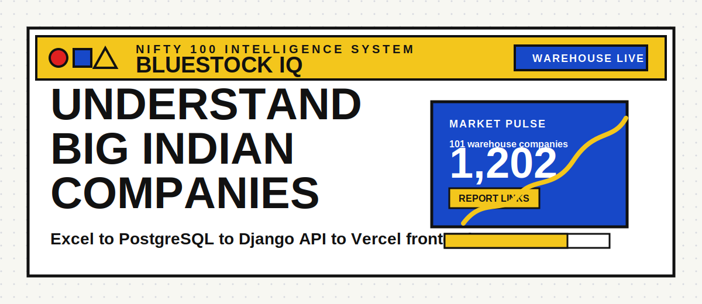
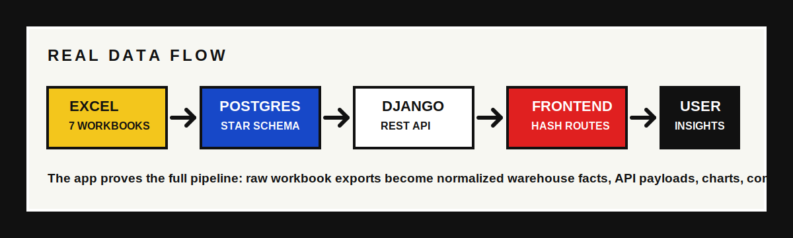
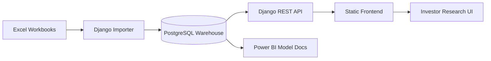

<p align="center">
  
</p>

<h1 align="center">Bluestock IQ</h1>

<p align="center">
  <strong>A loud, visual, warehouse-backed Nifty 100 intelligence system for people who want company research without drowning in annual reports.</strong>
</p>

<p align="center">
  <a href="https://nifty100dashboards.vercel.app"></a>
  <a href="https://nifty100-dashboards.onrender.com/api/health/"></a>
  
  
  
</p>

<p align="center">
  
</p>

---

## The Pitch

**Bluestock IQ** is a full-stack financial intelligence dashboard that turns raw Nifty 100 workbook exports into a clean investor-facing research cockpit. It is built to feel like a punchy mini Bloomberg terminal for Indian equities: bold UI, readable metrics, company drilldowns, report links, health scoring, sector comparison, dashboard narratives, and beginner-friendly explanations for finance terms that usually scare people away.

This is not a static landing page pretending to be a product. The stack proves the real flow:

**Excel exports -> PostgreSQL warehouse -> Django REST API -> Vercel frontend**

The live dataset currently supports:

| Signal | Coverage |
|---|---:|
| Warehouse companies | 101 |
| Source Excel workbooks | 7 |
| Valid annual report links | 1,200+ |
| API endpoint families | 10+ |
| Dashboard lenses | 7 |
| Deployment targets | Vercel + Render + Supabase/PostgreSQL |

> Research support only. This is not investment advice, a buy/sell recommendation, or a promise that a high score means a stock is cheap.

---

## Live Links

| Surface | URL |
|---|---|
| Frontend | [nifty100dashboards.vercel.app](https://nifty100dashboards.vercel.app) |
| Backend health | [Render API health](https://nifty100-dashboards.onrender.com/api/health/) |
| Bootstrap payload | [Render bootstrap API](https://nifty100-dashboards.onrender.com/api/bootstrap/) |

---

## What Makes It Cool

- **Warehouse-first data layer**: normalized PostgreSQL star schema instead of loose JSON blobs.
- **Real Excel ingestion**: imports companies, profit and loss, balance sheets, cash flow, analysis, pros/cons, and documents.
- **Investor health score**: blends profitability, growth, leverage, cash flow, dividends, and trend signals into readable labels.
- **Company detail pages**: revenue, profit, EPS, OPM, debt, cash conversion, peer comparison, annual reports, pros, and watchpoints.
- **Reports library**: annual report links in one place with company and year filters.
- **Beginner explanations**: chart text, metric glossary, and explanations for OPM, ROE, D/E, CAGR, and cash conversion.
- **Deployment-safe frontend routing**: hash routes keep Vercel from eating internal navigation.
- **Data fallback awareness**: the UI can show when it is using demo data instead of the warehouse, so prototype mode does not masquerade as production.

---

## Architecture

<p align="center">
  
</p>



The backend prefers warehouse data whenever PostgreSQL is available. Demo data only exists as a resilience fallback for local development or failed API reads.

---

## Tech Stack

| Layer | Tools |
|---|---|
| Frontend | HTML, CSS, JavaScript, Chart.js-style visual layer, Vercel static hosting |
| Backend | Python 3.11, Django 4.2, Django REST Framework, drf-spectacular |
| Warehouse | PostgreSQL, dimensional tables, financial fact tables |
| Async/infra | Redis, Celery-ready worker, Docker Compose |
| Data source | Excel workbooks in `data/source/` |
| Deployment | Vercel frontend, Render backend, Supabase/PostgreSQL database |
| BI track | Power BI specs, DAX library, data model documentation |

---

## API Highlights

| Endpoint | Purpose |
|---|---|
| `/api/health/` | Backend heartbeat |
| `/api/bootstrap/` | Full frontend startup payload |
| `/api/companies/` | Searchable/paginated company list |
| `/api/companies/<symbol>/` | Company profile and financial snapshot |
| `/api/companies/<symbol>/health-score/` | Score breakdown and history |
| `/api/companies/<symbol>/growth-analytics/` | YoY and CAGR analytics |
| `/api/companies/<symbol>/documents/` | Annual report links |
| `/api/companies/<symbol>/peer-comparison/` | Sector peer context |
| `/api/sectors/comparison/` | Multi-sector comparison |
| `/api/schema/` and `/api/docs/` | OpenAPI schema and API docs |

---

## Project Map

```text
.
|-- backend/                  Django API, warehouse models, importers, tests
|-- data/source/              Excel workbooks powering the warehouse
|-- etl/                      SQL-dump style ETL pipeline modules
|-- frontend/                 Static Bluestock IQ interface
|-- powerbi/                  Dashboard specs, DAX measures, publishing notes
|-- docker-compose.yml        Local Postgres, Redis, web, worker stack
|-- DEPLOYMENT.md             Deployment notes for Render/Vercel/Railway
`-- vercel.json               Root Vercel routing/cache config
```

---

## Run Locally

Copy the environment template:

```powershell
Copy-Item .env.example .env
```

Build and start the stack:

```powershell
docker compose up --build
```

Run migrations and import the Excel warehouse:

```powershell
docker compose exec web python manage.py migrate
docker compose exec web python manage.py import_excel_workbooks
```

Open the local app:

```text
http://localhost:8000
```

Run tests:

```powershell
docker compose exec web python manage.py test apps.api apps.warehouse
```

---

## Source Workbooks

The live Django importer reads these files from `data/source/`:

| Workbook | What it feeds |
|---|---|
| `companies.xlsx` | company identity, sector, links, profile data |
| `profitandloss.xlsx` | revenue, expenses, OPM, net profit, EPS, dividends |
| `balancesheet.xlsx` | equity, reserves, borrowings, assets, leverage |
| `cashflow.xlsx` | operating, investing, financing, free cash flow |
| `analysis.xlsx` | CAGR, ROE, growth signals |
| `prosandcons.xlsx` | qualitative notes |
| `documents.xlsx` | annual report links |

The importer normalizes years, upserts dimensions/facts, generates score rows, and repairs missing document links from the bundled workbook when production data is incomplete.

---

## Deployment Notes

| Platform | Root directory | Notes |
|---|---|---|
| Vercel | `frontend` | Static frontend. `config.js` points to the Render API. |
| Render | repo root | Docker build uses `backend/Dockerfile` so `data/source/` is available. |
| Supabase/PostgreSQL | managed database | Stores the warehouse tables used by the API. |

Important production environment variables:

```env
DJANGO_DEBUG=False
DJANGO_SECRET_KEY=your-secret
DJANGO_ALLOWED_HOSTS=your-render-domain
CORS_ALLOWED_ORIGINS=https://your-vercel-domain
CSRF_TRUSTED_ORIGINS=https://your-vercel-domain
DATABASE_URL=postgresql://...
IMPORT_EXCEL_ON_STARTUP=true
```

---

## Quality Gates

- API and warehouse tests cover bootstrap, company list/detail, health score, growth analytics, documents, sector comparison, and importer behavior.
- CORS supports production Vercel and project preview deployments.
- Report links are filtered so placeholder values like `Null` do not show as fake documents.
- Bootstrap is optimized to avoid N+1 warehouse reads.
- Docker startup runs migrations and can import Excel data on deploy.

---

## Power BI Track

The repository also contains a Power BI delivery track in `powerbi/`:

- dashboard build specs
- data model relationships
- DAX measure library
- publishing and refresh notes
- PostgreSQL connection guide

This lets the project tell the same story in two ways: a public web app for fast browsing, and a BI layer for analyst-grade dashboarding.

---

## Final Word

Bluestock IQ is built like a financial research engine with a loud jacket on: serious warehouse data underneath, bold interface on top, and enough explanation to help a beginner stop staring at raw annual reports like they are ancient stone tablets.
